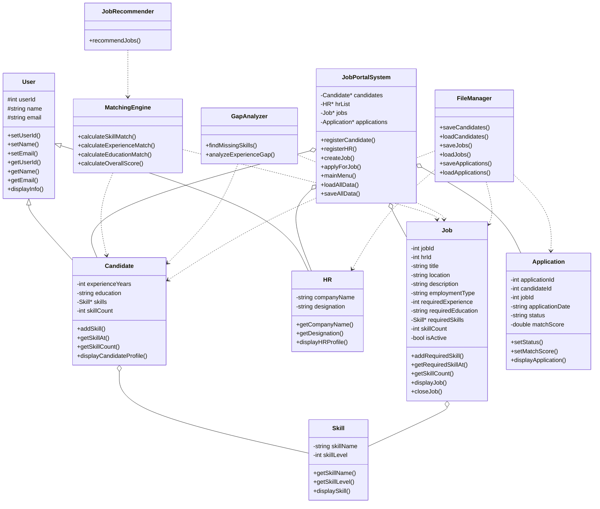
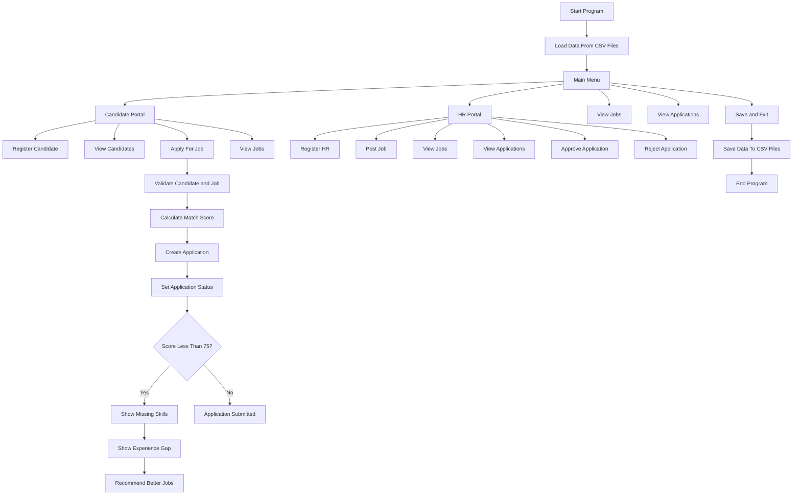
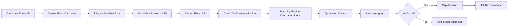
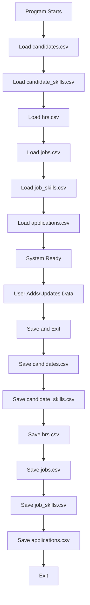

```markdown
# 🚀 Mini LinkedIn / CV Shortlister System

> A professional **C++ OOP-based Job Matching and CV Shortlisting System** where HRs can post jobs, candidates can apply, and the system intelligently calculates matching scores, detects missing skills, and recommends better jobs.

---

## 📌 Project Overview

**Mini LinkedIn / CV Shortlister System** is a console-based C++ project built using strong Object-Oriented Programming concepts.  
The system simulates a real recruitment/job portal where:

- HRs can register and post jobs.
- Candidates can register and build profiles with skills, education, and experience.
- Candidates can apply for jobs.
- The system calculates a job-matching score.
- Applications are automatically marked as:
  - Approved
  - Under Review
  - Recommended
  - Rejected
- If the candidate is not a strong match, the system shows:
  - Missing skills
  - Experience gap
  - Better recommended jobs
- Data is stored permanently using CSV files.

This project is designed without using a database and without STL vectors.  
It uses:

- OOP
- Dynamic arrays
- File handling
- CSV storage
- Manual memory management

---

## ✨ Key Highlights

```text
✅ Object-Oriented Design
✅ Dynamic Arrays Instead of Vector
✅ CSV File Storage
✅ HR and Candidate Modules
✅ Auto-generated IDs
✅ Gmail and Input Validation
✅ Skill-Level Based Matching
✅ Gap Analysis
✅ Job Recommendation System
✅ Application Approval/Rejection
✅ Persistent Data Storage
```

---

## 🧠 Core Idea

The system compares a candidate profile with a job requirement using:

```text
Candidate Skills
Candidate Skill Levels
Candidate Experience
Candidate Education
```

against:

```text
Required Job Skills
Required Skill Levels
Required Experience
Required Education
```

Then it generates a final matching score.

---

## 🛠️ Technologies Used

| Technology | Purpose |
|----------|---------|
| C++ | Main programming language |
| OOP | Project architecture |
| Dynamic Arrays | Runtime storage |
| CSV Files | Permanent storage |
| File Handling | Save/load data |
| VS Code | Development environment |
| g++ | Compilation |

---

## 📁 Project Structure

```text
Mini-LinkedIn-CV-Shortlister/
│
├── main.cpp
│
├── Skill.h
├── Skill.cpp
│
├── User.h
├── User.cpp
│
├── Candidate.h
├── Candidate.cpp
│
├── HR.h
├── HR.cpp
│
├── Job.h
├── Job.cpp
│
├── Application.h
├── Application.cpp
│
├── Portal.h
├── Portal.cpp
│
├── MatchingEngine.h
├── MatchingEngine.cpp
│
├── GapAnalyzer.h
├── GapAnalyzer.cpp
│
├── JobRecommender.h
├── JobRecommender.cpp
│
├── FileManager.h
├── FileManager.cpp
│
├── candidates.csv
├── candidate_skills.csv
├── hrs.csv
├── jobs.csv
├── job_skills.csv
├── applications.csv
│
└── README.md
```

---

## 🧩 Main Modules

### 1. User Module

Base class for common user data.

```text
User
├── Candidate
└── HR
```

Common properties:

```text
ID
Name
Email
```

---

### 2. Candidate Module

Stores candidate profile information:

```text
Candidate ID
Name
Gmail
Experience
Education
Skills
Skill Levels
```

Candidate can:

```text
Register
View jobs
Apply for jobs
Receive recommendations
```

---

### 3. HR Module

Stores HR information:

```text
HR ID
Name
Gmail
Company
Designation
```

HR can:

```text
Register
Post jobs
View applications
Approve applications
Reject applications
```

---

### 4. Job Module

Stores job posting details:

```text
Job ID
HR ID
Title
Location
Description
Employment Type
Required Experience
Required Education
Required Skills
Skill Levels
Status
```

---

### 5. Application Module

Stores candidate-job application records:

```text
Application ID
Candidate ID
Job ID
Date
Status
Match Score
```

---

### 6. Matching Engine

Calculates the candidate's suitability for a job.

Considers:

```text
Skills
Skill Levels
Experience
Education
```

---

### 7. Gap Analyzer

Finds what the candidate is missing:

```text
Missing skills
Experience gap
```

---

### 8. Job Recommender

Recommends better jobs based on candidate profile.

---

### 9. File Manager

Handles CSV storage:

```text
Save candidates
Load candidates
Save candidate skills
Load candidate skills
Save HRs
Load HRs
Save jobs
Load jobs
Save job skills
Load job skills
Save applications
Load applications
```

---

## 🧱 OOP Concepts Used

| OOP Concept | Usage |
|-----------|-------|
| Encapsulation | Private data members with getters/setters |
| Inheritance | Candidate and HR inherit from User |
| Composition | Candidate and Job contain Skill objects |
| Abstraction | MatchingEngine hides scoring logic |
| Dynamic Memory | Dynamic arrays for candidates, jobs, HRs, applications |
| Rule of Three | Used for classes with dynamic arrays |
| Modularity | Separate files/classes for each responsibility |

---

## 🧬 UML Class Diagram



---

## 🔄 System Flowchart



---

## 🎯 Candidate Application Flow



---

## 💾 File Storage Flow



---

## 🧮 Matching Algorithm

### Skill Matching

Each required job skill is compared with candidate skills.

If skill exists:

```text
If candidate level >= required level:
    Skill score = 100
Else:
    Skill score = candidateLevel / requiredLevel × 100
```

If skill is missing:

```text
Skill score = 0
```

Final skill score:

```text
Average of all required skill scores
```

---

### Experience Matching

```text
If candidate experience >= required experience:
    Experience score = 100
Else:
    Experience score = candidateExperience / requiredExperience × 100
```

---

### Education Matching

```text
If candidate education == required education:
    Education score = 100
Else:
    Education score = 0
```

---

### Final Overall Score

```text
Overall Score =
Skill Score × 0.60
+
Experience Score × 0.25
+
Education Score × 0.15
```

---

## 📊 Application Status Rules

| Score Range | Status |
|-----------|--------|
| 90 - 100 | Approved |
| 75 - 89 | Under Review |
| 60 - 74 | Recommended |
| Below 60 | Rejected |

---

## 🧠 Recommendation Logic

If candidate score is low, the system:

1. Finds missing required skills.
2. Checks experience gap.
3. Compares candidate profile with all other jobs.
4. Excludes the already applied job.
5. Recommends top matching jobs.

Example:

```text
Applied Job:
Backend Developer

Score:
52%

Missing Skills:
SQL
Docker

Recommended Jobs:
1. Junior C++ Developer - 91%
2. Backend Intern - 84%
3. Software Engineer - 78%
```

---

## ✅ Validations Implemented

| Input | Validation |
|-----|------------|
| Gmail | Must end with `@gmail.com` |
| Gmail | Cannot be duplicate |
| Name | Only letters and spaces |
| Education | MATRIC, FSC, BS, MS, PHD |
| Experience | Cannot be negative |
| Skill Level | Must be between 1 and 10 |
| Menu Choice | Must be within valid range |
| Candidate ID | Auto-generated |
| HR ID | Auto-generated |
| Job ID | Auto-generated |
| Application ID | Auto-generated |
| Duplicate Application | Not allowed |
| Duplicate Skills | Not allowed |
| Job Posting | HR must exist |
| Apply Job | Candidate and job must exist |

---

## 🆔 Auto-Generated ID Format

| Entity | ID Range |
|------|----------|
| Candidate | 1001, 1002, 1003... |
| HR | 2001, 2002, 2003... |
| Job | 3001, 3002, 3003... |
| Application | 4001, 4002, 4003... |

---

## 💽 CSV File Formats

### `candidates.csv`

```csv
ID,Name,Email,Experience,Education
1001,Ali,ali@gmail.com,2,BS
```

---

### `candidate_skills.csv`

```csv
CandidateID,SkillName,SkillLevel
1001,C++,8
1001,OOP,9
1001,SQL,6
```

---

### `hrs.csv`

```csv
ID,Name,Email,Company,Designation
2001,Sarah,sarah@gmail.com,Google,Recruiter
```

---

### `jobs.csv`

```csv
ID,HRID,Title,Location,Description,Type,Experience,Education,Status
3001,2001,Backend Developer,Lahore,Develop APIs,Full Time,2,BS,Active
```

---

### `job_skills.csv`

```csv
JobID,SkillName,SkillLevel
3001,C++,8
3001,OOP,9
3001,SQL,7
```

---

### `applications.csv`

```csv
AppID,CandidateID,JobID,Date,Status,MatchScore
4001,1001,3001,2026-06-14,Under Review,82.5
```

---

## ▶️ How To Run

### Requirements

Make sure you have:

```text
g++
VS Code terminal / PowerShell
```

---

### Compile and Run

Use this single command:

```powershell
g++ main.cpp Skill.cpp User.cpp Candidate.cpp HR.cpp Job.cpp Application.cpp Portal.cpp MatchingEngine.cpp GapAnalyzer.cpp JobRecommender.cpp FileManager.cpp -o test; .\test.exe
```

---

### Linux/Mac Command

```bash
g++ main.cpp Skill.cpp User.cpp Candidate.cpp HR.cpp Job.cpp Application.cpp Portal.cpp MatchingEngine.cpp GapAnalyzer.cpp JobRecommender.cpp FileManager.cpp -o test && ./test
```

---

## 🧪 Manual Testing Guide

### Test 1: Candidate Registration

Steps:

```text
1. Open Candidate Portal
2. Register Candidate
3. Enter valid name
4. Enter valid gmail ending with @gmail.com
5. Enter experience
6. Enter education
7. Add skills
```

Expected result:

```text
Candidate registered successfully.
Candidate ID generated automatically.
Candidate saved in candidates.csv.
Skills saved in candidate_skills.csv.
```

---

### Test 2: Gmail Validation

Input:

```text
ali@yahoo.com
```

Expected:

```text
Must be @gmail.com
Enter again:
```

Input duplicate Gmail:

```text
ali@gmail.com
```

Expected:

```text
Email already exists.
Enter again:
```

---

### Test 3: HR Registration

Steps:

```text
1. Open HR Portal
2. Register HR
3. Enter name
4. Enter gmail
5. Enter company
6. Enter designation
```

Expected:

```text
HR registered successfully.
HR ID generated automatically.
Data saved in hrs.csv.
```

---

### Test 4: Job Posting

Steps:

```text
1. HR Portal
2. Post Job
3. Enter valid HR ID
4. Enter job details
5. Add required skills
```

Expected:

```text
Job posted successfully.
Job saved in jobs.csv.
Required skills saved in job_skills.csv.
```

---

### Test 5: Candidate Applies For Job

Steps:

```text
1. Candidate Portal
2. Apply For Job
3. Enter Candidate ID
4. Select Job ID
5. Enter date
```

Expected:

```text
Application ID generated.
Match score calculated.
Status assigned.
Application saved in applications.csv.
```

---

### Test 6: Low Score Recommendation

If score is below 75:

Expected:

```text
Missing skills displayed.
Experience gap displayed.
Recommended jobs displayed.
```

---

### Test 7: Duplicate Application

Try applying to the same job twice.

Expected:

```text
Already applied.
```

---

### Test 8: Persistence Test

Steps:

```text
1. Register candidate
2. Register HR
3. Post job
4. Apply for job
5. Save and exit
6. Run program again
7. View candidates/jobs/applications
```

Expected:

```text
All previous data should still be available.
Candidate skills and job skills should also be loaded.
```

---

## 🔁 Reset Project Data

If you want to delete all CSV files and start fresh:

### Windows PowerShell

```powershell
Remove-Item *.csv -ErrorAction SilentlyContinue
```

Then run the project again.

CSV files will be created again when you choose:

```text
Save & Exit
```

---

## 🖥️ Example Console Flow

```text
=================================
          Mini Linkedin
=================================
Candidates     : 2
HRs            : 1
Jobs           : 3
Applications   : 4
---------------------------------
1. Candidate Portal
2. HR Portal
3. View Jobs
4. View Applications
0. Save & Exit

Enter Choice:
```

---

## 📌 Example Matching Result

```text
===== APPLICATION RESULT =====

Application ID: 4001
Match Score: 76.67%
Status: Under Review

Application Submitted Successfully.
```

---

## 📌 Example Gap Analysis

```text
===== Missing Skills =====
- SQL
- Docker

===== Experience Analysis =====
Need 1 more year(s) of experience.
```

---

## 📌 Example Job Recommendation

```text
===== Recommended Jobs =====

1. Junior C++ Developer -> 92%
2. Backend Intern -> 85%
3. Software Engineer -> 78%
```

---

## 🧪 Test Case Table

| Test Case | Input | Expected Output |
|---------|-------|-----------------|
| Invalid Gmail | `abc@yahoo.com` | Ask again |
| Duplicate Gmail | Existing Gmail | Reject |
| Invalid Name | `Ali123` | Ask again |
| Invalid Education | `MBA` | Ask again |
| Invalid Skill Level | `15` | Ask again |
| Duplicate Skill | Same skill twice | Reject duplicate |
| Invalid HR ID while posting job | Non-existing ID | HR not found |
| Duplicate Application | Same candidate same job | Already applied |
| Low Score | Missing skills | Gap analysis + recommendations |
| Save and Restart | Existing data | Data reloads from CSV |

---

## ⚠️ Known Limitations

This project is intentionally built using dynamic arrays and CSV files for learning purposes.

Current limitations:

```text
1. No password-based login system.
2. CSV parsing does not support commas inside fields.
3. Skill names are exact-match based.
4. Education matching is exact.
5. No database integration.
6. IDs are count-based.
7. No GUI.
```

---

## 🚀 Future Improvements

Possible future upgrades:

```text
1. Candidate login system
2. HR login system
3. Password authentication
4. View candidate's own applications
5. HR sees only their own posted jobs
6. HR shortlists top candidates for each job
7. Search jobs by skill/location/type
8. Sort jobs by match score
9. SQLite/MySQL database support
10. GUI using Qt
11. Export reports
12. Better CSV escaping
13. Case-insensitive skill matching
14. Education hierarchy matching
15. Auto date generation
```

---

## 🏆 Why This Project Is Valuable

This project demonstrates:

```text
Strong OOP design
Real-world problem solving
Manual memory management
File handling
Data persistence
Validation handling
Dynamic arrays
Modular architecture
Recommendation logic
Scoring system
```

It is suitable for:

```text
University semester project
OOP project
C++ file handling project
Resume/portfolio project
Recruitment system prototype
```

---

## 👨‍💻 Author

Developed by:

```text
Muhammad Sami Ullah
```

Project:

```text
Mini LinkedIn / CV Shortlister System
```

Language:

```text
C++
```

---

## 📜 License

This project is open for educational use.

You may modify, improve, and extend it for learning and portfolio purposes.

---

## ⭐ Final Note

This project started as a simple OOP idea and evolved into a complete recruitment simulation system with:

```text
Candidate management
HR management
Job posting
Application tracking
Matching engine
Gap analysis
Recommendations
CSV storage
```

It represents a strong foundation for building a real-world recruitment platform.
```
