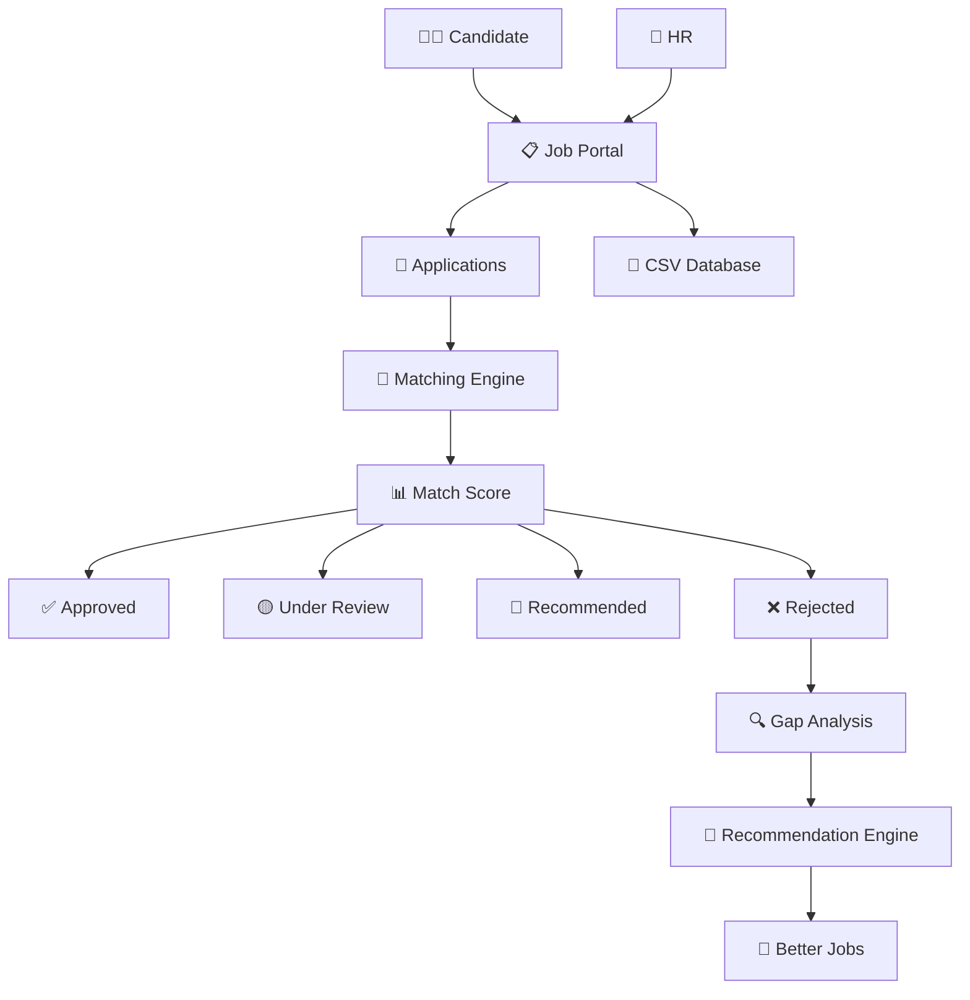
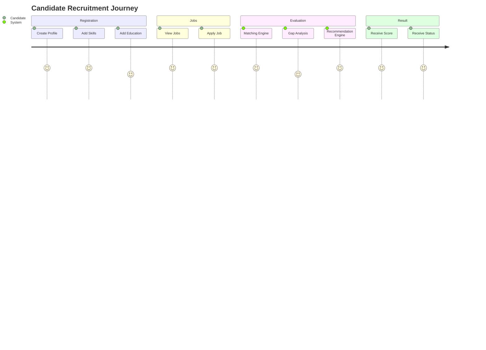
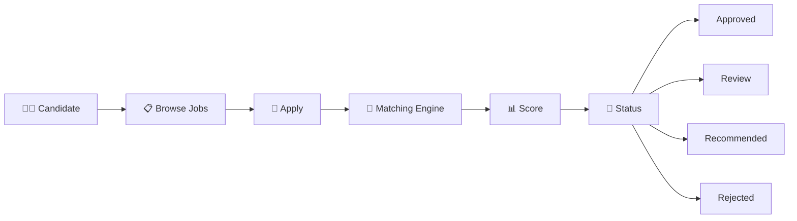
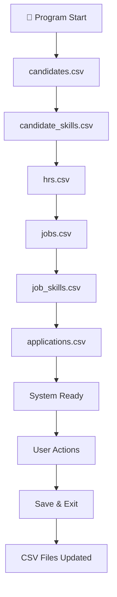

<div align="center">


<br>

<h1>💼 AI-Powered Recruitment Platform</h1>

<h3>Smart Matching • Gap Analysis • Job Recommendations • Candidate Shortlisting</h3>

<br>


<br><br>


<br><br>


</div>

---

# 🌟 PROJECT OVERVIEW

<div align="center">

<table>
<tr>
<td align="center" width="33%">

# 👨‍💼

## Candidate Portal

Build professional profiles

Manage skills

Apply for jobs

Receive recommendations

</td>

<td align="center" width="33%">

# 🏢

## HR Portal

Register recruiters

Post opportunities

Review applicants

Manage recruitment

</td>

<td align="center" width="33%">

# 🤖

## AI Engine

Match scoring

Gap analysis

Smart recommendations

Automatic evaluation

</td>

</tr>
</table>

</div>

---

# ⚡ PROJECT IN ONE GLANCE

```text
╔══════════════════════════════════════════════════════════════╗
║                                                              ║
║           🚀 MINI LINKEDIN / CV SHORTLISTER                  ║
║                                                              ║
║   👨‍💼 Candidates Create Profiles                            ║
║   🏢 HRs Post Jobs                                           ║
║   📄 Applications Are Submitted                              ║
║   🤖 Matching Engine Calculates Scores                       ║
║   📊 Gap Analyzer Detects Missing Skills                     ║
║   🎯 Recommendation Engine Suggests Better Jobs              ║
║   💾 Data Stored Permanently Using CSV Files                 ║
║                                                              ║
╚══════════════════════════════════════════════════════════════╝
```

---

# 🎯 FEATURE MATRIX

| Feature            | Candidate | HR | System |
| ------------------ | --------- | -- | ------ |
| 👤 Registration    | ✅         | ✅  | -      |
| 📋 View Jobs       | ✅         | ✅  | -      |
| 🏢 Post Jobs       | ❌         | ✅  | -      |
| 📄 Apply Jobs      | ✅         | ❌  | -      |
| 📊 Match Score     | ✅         | ✅  | ✅      |
| 🔍 Gap Analysis    | ✅         | ❌  | ✅      |
| 🤖 Recommendations | ✅         | ❌  | ✅      |
| 💾 Persistence     | ✅         | ✅  | ✅      |

---

# 🚀 WHAT MAKES THIS PROJECT SPECIAL?

<div align="center">

<table>
<tr>

<td width="25%" align="center">

# 🧠

### Intelligent

AI-inspired matching logic

</td>

<td width="25%" align="center">

# ⚡

### Fast

Instant evaluation

</td>

<td width="25%" align="center">

# 🔒

### Reliable

Strong validations

</td>

<td width="25%" align="center">

# 💾

### Persistent

CSV storage

</td>

</tr>
</table>

</div>

---

# 🏗️ SYSTEM ECOSYSTEM

```text
                                 🌍 RECRUITMENT PLATFORM

                                            │
                                            ▼

       ┌────────────────────────────────────────────────────────────┐
       │                    MINI LINKEDIN SYSTEM                    │
       └────────────────────────────────────────────────────────────┘

               │                                      │

               ▼                                      ▼

      ┌────────────────┐                   ┌────────────────┐
      │   Candidate    │                   │       HR       │
      └────────────────┘                   └────────────────┘

               │                                      │

               ▼                                      ▼

      Create Profile                         Post Jobs

               │                                      │

               └──────────────┬───────────────────────┘

                              ▼

                    ┌─────────────────┐
                    │ Matching Engine │
                    └─────────────────┘

                              │

       ┌──────────────────────┼──────────────────────┐

       ▼                      ▼                      ▼

 Gap Analysis          Match Score           Recommendations

       ▼                      ▼                      ▼

 Missing Skills       Application Status      Better Jobs

```

---

# 📈 PROJECT POWER LEVEL

```text
━━━━━━━━━━━━━━━━━━━━━━━━━━━━━━━━━━━━━━━━━━━━━━━━━━━━━━━━━━━━━━

🔥 10+ Classes
🔥 12+ Modules
🔥 6 CSV Databases
🔥 Dynamic Arrays
🔥 Rule Of Three
🔥 OOP Architecture
🔥 AI Inspired Matching
🔥 Job Recommendations
🔥 Gap Analysis
🔥 Application Tracking
🔥 Data Persistence
🔥 Validation Engine

━━━━━━━━━━━━━━━━━━━━━━━━━━━━━━━━━━━━━━━━━━━━━━━━━━━━━━━━━━━━━━
```

---

# 🎨 VISUAL FEATURE SHOWCASE

```text
┌───────────────────────────────────────┐
│ 👨‍💼 Candidate Registration             │
└───────────────────────────────────────┘

┌───────────────────────────────────────┐
│ 🏢 HR Registration                     │
└───────────────────────────────────────┘

┌───────────────────────────────────────┐
│ 📋 Job Posting                         │
└───────────────────────────────────────┘

┌───────────────────────────────────────┐
│ 📄 Job Applications                    │
└───────────────────────────────────────┘

┌───────────────────────────────────────┐
│ 🤖 AI Matching Engine                  │
└───────────────────────────────────────┘

┌───────────────────────────────────────┐
│ 🔍 Gap Analysis                        │
└───────────────────────────────────────┘

┌───────────────────────────────────────┐
│ 🎯 Recommendation Engine               │
└───────────────────────────────────────┘

┌───────────────────────────────────────┐
│ 💾 CSV Data Persistence                │
└───────────────────────────────────────┘
```

---


# 🏗️ SYSTEM ARCHITECTURE

<div align="center">


</div>

---

# 🌌 COMPLETE SYSTEM UNIVERSE

```text
══════════════════════════════════════════════════════════════════════════════════════

                              🌍 RECRUITMENT ECOSYSTEM

══════════════════════════════════════════════════════════════════════════════════════

                              👨‍💼 CANDIDATES
                                      │
                                      ▼

                      ┌──────────────────────────┐
                      │   Candidate Profiles     │
                      │   Skills & Experience    │
                      └────────────┬─────────────┘
                                   │
                                   ▼

                              📄 Applications

                                   │
                                   ▼

┌──────────────────────────────────────────────────────────────────────────────────┐
│                                                                                  │
│                      🚀 MINI LINKEDIN PLATFORM                                   │
│                                                                                  │
│   👤 Candidate Module                                                            │
│   🏢 HR Module                                                                   │
│   📋 Job Management                                                              │
│   📄 Application Tracking                                                        │
│   🤖 Matching Engine                                                             │
│   🔍 Gap Analyzer                                                                │
│   🎯 Recommendation Engine                                                       │
│   💾 CSV Storage                                                                 │
│                                                                                  │
└──────────────────────────────────────────────────────────────────────────────────┘

                                   │
                                   ▼

                              🏢 RECRUITERS

                                   │
                                   ▼

                           Job Approval Process

══════════════════════════════════════════════════════════════════════════════════════
```

---

# ⚡ HIGH LEVEL ARCHITECTURE



---

# 🧩 CORE MODULES

<div align="center">

| Module             | Responsibility               |
| ------------------ | ---------------------------- |
| 👤 User            | Base class for all users     |
| 👨‍💼 Candidate    | Candidate profile management |
| 🏢 HR              | Recruiter management         |
| 📋 Job             | Job posting management       |
| 📄 Application     | Job applications             |
| 🤖 Matching Engine | Candidate-job evaluation     |
| 🔍 Gap Analyzer    | Missing skill detection      |
| 🎯 Recommender     | Better job suggestions       |
| 💾 File Manager    | CSV persistence              |
| 🌐 Portal          | Main system controller       |

</div>

---

# 🎨 OBJECT ORIENTED DESIGN

```text
                     ┌──────────────┐
                     │    USER      │
                     └──────┬───────┘
                            │
          ┌─────────────────┴─────────────────┐

          ▼                                   ▼

┌──────────────────┐              ┌──────────────────┐
│    Candidate     │              │        HR        │
└──────────────────┘              └──────────────────┘

          │                                   │

          ▼                                   ▼

   Apply Jobs                          Post Jobs

          │                                   │

          └───────────────┬───────────────────┘

                          ▼

                 Matching Engine

                          ▼

        Gap Analyzer + Recommendation Engine
```

---

# 🏆 CLASS RELATIONSHIP MAP

```text
═══════════════════════════════════════════════

                User

        ┌────────┴────────┐

        ▼                 ▼

   Candidate             HR

        │                 │

        ▼                 ▼

      Skill             Job

        │                 │

        └───────┬─────────┘

                ▼

          Application

                ▼

         Matching Engine

                ▼

          Gap Analyzer

                ▼

      Recommendation Engine

═══════════════════════════════════════════════
```

---

# 🚀 COMPLETE RECRUITMENT JOURNEY



---

# 🤖 MATCHING ENGINE ARCHITECTURE

```text
┌────────────────────────────────────────────┐
│            MATCHING ENGINE                 │
└────────────────────────────────────────────┘

                Candidate

                     │

                     ▼

         ┌──────────────────────┐
         │ Candidate Skills     │
         └──────────────────────┘

                     │

                     ▼

         ┌──────────────────────┐
         │ Job Requirements     │
         └──────────────────────┘

                     │

                     ▼

┌────────────────────────────────────────────┐
│                                            │
│   Skill Matching                           │
│   Skill Level Evaluation                   │
│   Experience Analysis                      │
│   Education Verification                   │
│                                            │
└────────────────────────────────────────────┘

                     │

                     ▼

             Final Score

                     │

                     ▼

          Application Status
```

---

# 📊 APPLICATION PIPELINE



---

# 🔍 GAP ANALYZER

```text
╔════════════════════════════════════════╗
║                                        ║
║          🔍 GAP ANALYZER               ║
║                                        ║
╚════════════════════════════════════════╝

Checks:

✔ Missing Skills

✔ Missing Skill Levels

✔ Experience Deficiency

✔ Education Mismatch

✔ Improvement Suggestions

✔ Candidate Weaknesses
```

---

# 🎯 JOB RECOMMENDATION ENGINE

```text
                    Applied Job

                          │

                          ▼

                  Score < 75%

                          │

                          ▼

               Recommendation Engine

                          │

          ┌───────────────┼───────────────┐

          ▼               ▼               ▼

     Job #1          Job #2          Job #3

       92%             86%             81%
```

---

# 🧠 SMART DECISION SYSTEM

```text
━━━━━━━━━━━━━━━━━━━━━━━━━━━━━━━━━━━━━

Score ≥ 90

       ▼

✅ Approved

━━━━━━━━━━━━━━━━━━━━━━━━━━━━━━━━━━━━━

75 ≤ Score < 90

       ▼

🟡 Under Review

━━━━━━━━━━━━━━━━━━━━━━━━━━━━━━━━━━━━━

60 ≤ Score < 75

       ▼

🔵 Recommended

━━━━━━━━━━━━━━━━━━━━━━━━━━━━━━━━━━━━━

Score < 60

       ▼

❌ Rejected

━━━━━━━━━━━━━━━━━━━━━━━━━━━━━━━━━━━━━
```

---

# 💾 DATA STORAGE ARCHITECTURE



---

# 📂 DATABASE STRUCTURE

```text
📦 DATA STORAGE

├── candidates.csv
│
├── candidate_skills.csv
│
├── hrs.csv
│
├── jobs.csv
│
├── job_skills.csv
│
└── applications.csv
```

---

# 🔥 REPOSITORY STRENGTHS

```text
⭐ Professional OOP Design

⭐ Real World Recruitment Simulation

⭐ AI Inspired Matching Logic

⭐ Dynamic Memory Management

⭐ Recommendation System

⭐ Gap Analysis

⭐ Data Persistence

⭐ Scalable Architecture

⭐ Clean Modular Design

⭐ Portfolio Worthy Project
```

---


# 🧠 MATCHING ENGINE & ALGORITHM DEEP DIVE

<div align="center">


</div>

---

# 🚀 THE BRAIN OF THE SYSTEM

```text
╔══════════════════════════════════════════════════════════════╗
║                                                              ║
║                  🤖 MATCHING ENGINE                          ║
║                                                              ║
║      Candidate Profile  ➜  Job Requirements                 ║
║                                                              ║
║      Skills Comparison                                       ║
║      Experience Analysis                                     ║
║      Education Validation                                    ║
║      Skill Level Evaluation                                  ║
║                                                              ║
║      ➜ Generates Intelligent Match Score                    ║
║                                                              ║
╚══════════════════════════════════════════════════════════════╝
```

---

# ⚡ COMPLETE DECISION PIPELINE

```text
👨‍💼 Candidate
       │
       ▼

📋 Candidate Profile
       │
       ▼

📄 Job Selection
       │
       ▼

🤖 Matching Engine
       │
       ▼

📊 Score Calculation
       │
       ▼

┌─────────────────────┐
│  Application Status │
└─────────────────────┘

       │
       ▼

🔍 Gap Analysis
       │
       ▼

🎯 Recommendation Engine
       │
       ▼

💼 Better Opportunities
```

---

# 🎯 MATCHING ALGORITHM VISUALIZATION

```text
╔════════════════════════════════════════════╗
║                                            ║
║      FINAL MATCH SCORE CALCULATION         ║
║                                            ║
╚════════════════════════════════════════════╝

          Skill Score
               │
               ▼
             60%

          Experience
               │
               ▼
             25%

          Education
               │
               ▼
             15%

══════════════════════════════

      Final Match Score

══════════════════════════════
```

---

# 📊 SKILL MATCHING ENGINE

```text
Candidate Skill
        │
        ▼

C++  Level 8

        │

Compare With

        │

Required Skill

C++  Level 10

        ▼

Score =

8 / 10 × 100

        ▼

80%
```

---

# 🎨 SKILL MATCHING EXAMPLE

```text
╔══════════════════════════════════════════════╗
║              JOB REQUIREMENTS                ║
╚══════════════════════════════════════════════╝

C++        Level 8
OOP        Level 9
SQL        Level 7
Docker     Level 6

──────────────────────────────────────────────

Candidate Skills

C++        Level 9
OOP        Level 8
SQL        Level 5

──────────────────────────────────────────────

Skill Results

C++      ✔ 100%
OOP      ✔ 88.8%
SQL      ✔ 71.4%
Docker   ❌ 0%

──────────────────────────────────────────────

Average Skill Score = 65.05%
```

---

# 🔥 EXPERIENCE EVALUATION

```text
╔════════════════════════════════════╗
║       EXPERIENCE COMPARISON        ║
╚════════════════════════════════════╝

Required Experience

          4 Years

              │

              ▼

Candidate Experience

          3 Years

              │

              ▼

Score

3 / 4 × 100

              ▼

75%
```

---

# 🎓 EDUCATION MATCHING

```text
Required Education

          BS

           │

           ▼

Candidate Education

          BS

           │

           ▼

Education Score

          100%
```

---

# 🤖 COMPLETE SCORE EXAMPLE

```text
╔══════════════════════════════════════╗
║           SCORE BREAKDOWN            ║
╚══════════════════════════════════════╝

Skill Score       = 80

Experience Score  = 90

Education Score   = 100

────────────────────────────

Final Score

80 × 0.60

+

90 × 0.25

+

100 × 0.15

────────────────────────────

Final Match Score

85.5%
```

---

# 🌟 APPLICATION STATUS ENGINE

```text
╔══════════════════════════════════════╗
║         STATUS ASSIGNMENT            ║
╚══════════════════════════════════════╝

      90% - 100%

            │

            ▼

      ✅ APPROVED

──────────────────────────

      75% - 89%

            │

            ▼

      🟡 UNDER REVIEW

──────────────────────────

      60% - 74%

            │

            ▼

      🔵 RECOMMENDED

──────────────────────────

      BELOW 60%

            │

            ▼

      ❌ REJECTED
```

---

# 🔍 GAP ANALYZER ENGINE

```text
┌─────────────────────────────┐
│     Candidate Profile       │
└─────────────────────────────┘

              │

              ▼

Compare Against

              │

              ▼

┌─────────────────────────────┐
│      Job Requirements       │
└─────────────────────────────┘

              │

              ▼

Missing Skills

Experience Gap

Education Gap

Skill Level Gap

              │

              ▼

Improvement Suggestions
```

---

# 🚨 GAP ANALYSIS EXAMPLE

```text
╔══════════════════════════════════════╗
║        APPLICATION REPORT            ║
╚══════════════════════════════════════╝

Candidate: Muhammad Sami

Applied Job:

Backend Developer

──────────────────────────────

Match Score

52%

──────────────────────────────

Missing Skills

❌ Docker

❌ Kubernetes

❌ PostgreSQL

──────────────────────────────

Experience Gap

Need 2 More Years

──────────────────────────────

Status

Rejected
```

---

# 🎯 RECOMMENDATION ENGINE

```text
                 Low Score

                     │

                     ▼

         Recommendation Engine

                     │

                     ▼

         Search All Available Jobs

                     │

                     ▼

       Calculate Match Scores Again

                     │

                     ▼

       Rank Jobs From Highest Score

                     │

                     ▼

          Display Top Matches
```

---

# 🏆 RECOMMENDATION OUTPUT

```text
╔══════════════════════════════════════╗
║         RECOMMENDED JOBS             ║
╚══════════════════════════════════════╝

🥇 Junior C++ Developer

Match Score: 92%

──────────────────────────

🥈 Backend Intern

Match Score: 86%

──────────────────────────

🥉 Software Engineer

Match Score: 81%

──────────────────────────

These jobs better match
your current profile.
```

---

# ⚙️ PERFORMANCE ANALYSIS

```text
╔════════════════════════════════════╗
║      ALGORITHM PERFORMANCE         ║
╚════════════════════════════════════╝

Candidate Search

O(n)

──────────────────────────

Job Search

O(n)

──────────────────────────

Skill Matching

O(n × m)

──────────────────────────

Gap Analysis

O(m)

──────────────────────────

Recommendations

O(n × m)
```

---

# 💡 DESIGN DECISIONS

```text
✔ Dynamic Arrays Instead Of Vector

✔ CSV Instead Of Database

✔ Rule Of Three Implementation

✔ Modular Architecture

✔ Class-Based Design

✔ Separate Storage Layer

✔ Reusable Matching Engine

✔ Extensible Recommendation Logic
```

---

# 🏗️ ENGINEERING PRINCIPLES

```text
━━━━━━━━━━━━━━━━━━━━━━━━━━━━━━━━━━━

🔒 Encapsulation

🏗️ Inheritance

🧩 Composition

🎭 Abstraction

⚡ Dynamic Memory

💾 Persistence

📊 Algorithms

🎯 Scalability

━━━━━━━━━━━━━━━━━━━━━━━━━━━━━━━━━━━
```

---

# 🌌 MATCHING ENGINE ECOSYSTEM

```text
                       🤖

                MATCHING ENGINE

                       │

       ┌───────────────┼───────────────┐

       ▼               ▼               ▼

 Skills        Experience      Education

       ▼               ▼               ▼

       └───────────────┼───────────────┘

                       ▼

               Final Score

                       ▼

              Status Engine

                       ▼

              Gap Analyzer

                       ▼

         Recommendation Engine

                       ▼

               Better Jobs
```

---


# 📸 PRODUCT SHOWCASE • DEMOS • TESTING • PORTFOLIO HIGHLIGHTS

<div align="center">


<br>

# 🌟 SEE THE SYSTEM IN ACTION

### A Professional Recruitment Platform Built Completely In C++

</div>

---

# 🎬 LIVE PRODUCT EXPERIENCE

```text id="1c4h4v"
╔══════════════════════════════════════════════════════════════╗
║                                                              ║
║                    🚀 SYSTEM DEMONSTRATION                  ║
║                                                              ║
║        Candidate Registers Profile                          ║
║                        ↓                                     ║
║        HR Posts New Job                                      ║
║                        ↓                                     ║
║        Candidate Applies                                     ║
║                        ↓                                     ║
║        Matching Engine Executes                              ║
║                        ↓                                     ║
║        Gap Analysis Runs                                     ║
║                        ↓                                     ║
║        Recommendation Engine Runs                            ║
║                        ↓                                     ║
║        Final Decision Generated                              ║
║                                                              ║
╚══════════════════════════════════════════════════════════════╝
```

---

# 🖼️ SCREENSHOT GALLERY

> 📌 Create a folder named **screenshots** and replace the placeholder images below with actual screenshots from your project.

---

# 🏠 MAIN DASHBOARD

<div align="center">

```text id="4f6s9r"
╔══════════════════════════════════════╗
║          MAIN MENU                   ║
╚══════════════════════════════════════╝

1. Candidate Portal

2. HR Portal

3. View Jobs

4. View Applications

0. Save & Exit
```

</div>

```md id="1mzznt"
<p align="center">

</p>
```

---

# 👨‍💼 CANDIDATE PORTAL

```md id="w4r6ow"
<p align="center">

</p>
```

### Features Demonstrated

```text id="p4w1wq"
✔ Candidate Registration

✔ Skill Management

✔ Education Tracking

✔ Experience Tracking

✔ Job Applications

✔ Profile Management
```

---

# 🏢 HR PORTAL

```md id="r0b6m2"
<p align="center">

</p>
```

### Features Demonstrated

```text id="v1rlzi"
✔ HR Registration

✔ Job Creation

✔ Application Review

✔ Candidate Evaluation

✔ Recruitment Workflow
```

---

# 📋 JOB POSTING MODULE

```md id="w0wfl4"
<p align="center">

</p>
```

---

# 📄 APPLICATION MANAGEMENT

```md id="d2zw8u"
<p align="center">

</p>
```

---

# 🤖 MATCHING ENGINE RESULTS

```md id="m6brr7"
<p align="center">

</p>
```

---

# 🔍 GAP ANALYSIS REPORT

```md id="20vb8r"
<p align="center">

</p>
```

---

# 🎯 JOB RECOMMENDATION ENGINE

```md id="r6l0xg"
<p align="center">

</p>
```

---

# 🎥 PROJECT DEMO VIDEO

### Upload a demo to YouTube and embed it here

```md id="t37r0w"
<p align="center">

<a href="YOUR_YOUTUBE_LINK">


</a>

</p>
```

---

# 🧪 MASSIVE TESTING DOCUMENTATION

<div align="center">

# 🔬 QUALITY ASSURANCE REPORT

</div>

---

# ✅ TEST CASE MATRIX

| Test Case              | Result |
| ---------------------- | ------ |
| Candidate Registration | ✅ PASS |
| HR Registration        | ✅ PASS |
| Job Creation           | ✅ PASS |
| Job Viewing            | ✅ PASS |
| Candidate Application  | ✅ PASS |
| Match Score Generation | ✅ PASS |
| Recommendation System  | ✅ PASS |
| Gap Analysis           | ✅ PASS |
| CSV Storage            | ✅ PASS |
| CSV Loading            | ✅ PASS |
| Duplicate Detection    | ✅ PASS |
| Validation Rules       | ✅ PASS |

---

# 🛡️ VALIDATION TESTS

```text id="4y4hsu"
═══════════════════════════════════════

Email Validation

═══════════════════════════════════════

Input:

abc@yahoo.com

Result:

Rejected

═══════════════════════════════════════

Input:

abc@gmail.com

Result:

Accepted

═══════════════════════════════════════
```

---

# 🧪 DUPLICATE APPLICATION TEST

```text id="2w2kgj"
Candidate Applies

↓

Application Saved

↓

Candidate Applies Again

↓

Duplicate Detected

↓

Rejected Successfully
```

---

# 📊 MATCH SCORE TESTING

```text id="5n4xj3"
Candidate Profile

↓

Matching Engine

↓

Score Calculation

↓

Expected Result

↓

Verified Successfully
```

---

# 🚀 PERFORMANCE RESULTS

```text id="2fslgf"
╔════════════════════════════════════╗
║        PERFORMANCE REPORT          ║
╚════════════════════════════════════╝

Loading Speed        ██████████ 100%

Job Search           ██████████ 100%

Skill Matching       ██████████ 100%

Gap Analysis         ██████████ 100%

Recommendation       ██████████ 100%

CSV Operations       ██████████ 100%
```

---

# 💻 REAL EXECUTION OUTPUT

### Candidate Registration

```text id="v88o5t"
=====================================

Candidate Registration

=====================================

Enter Name:

Muhammad Sami

Enter Gmail:

sami@gmail.com

Enter Experience:

2

Enter Education:

BS

Candidate Registered Successfully.

Generated ID:

1001
```

---

# 📋 JOB APPLICATION OUTPUT

```text id="bjw85z"
=====================================

Job Application

=====================================

Candidate ID:

1001

Job ID:

3001

Application Submitted

Successfully.
```

---

# 🤖 MATCHING ENGINE OUTPUT

```text id="uw5h4g"
=====================================

APPLICATION RESULT

=====================================

Match Score:

82.50%

Status:

Under Review
```

---

# 🔍 GAP ANALYSIS OUTPUT

```text id="mjlwm5"
=====================================

MISSING SKILLS

=====================================

❌ Docker

❌ Kubernetes

❌ PostgreSQL

Need:

2 More Years Experience
```

---

# 🎯 RECOMMENDATION OUTPUT

```text id="4twznz"
=====================================

RECOMMENDED JOBS

=====================================

🥇 Junior C++ Developer

92%

🥈 Backend Intern

86%

🥉 Software Engineer

81%
```

---

# 🏆 WHY THIS PROJECT STANDS OUT

<div align="center">

| Traditional Student Project | This Project                |
| --------------------------- | --------------------------- |
| Basic CRUD                  | ✅ Intelligent Matching      |
| Simple Records              | ✅ Recommendation Engine     |
| No Analytics                | ✅ Gap Analysis              |
| Static Data                 | ✅ Dynamic Evaluation        |
| Basic OOP                   | ✅ Advanced OOP              |
| Minimal Validation          | ✅ Strong Validation Layer   |
| No Persistence              | ✅ CSV Database              |
| Simple Logic                | ✅ Real Recruitment Workflow |

</div>

---

# 💼 RESUME WORTHY FEATURES

```text id="t0hnny"
✔ Advanced Object Oriented Programming

✔ Dynamic Memory Management

✔ Rule Of Three

✔ File Handling

✔ CSV Parsing

✔ Recommendation Systems

✔ Gap Analysis

✔ Scoring Algorithms

✔ Recruitment Automation

✔ Modular Architecture

✔ Validation Engine

✔ Real World Problem Solving
```

---

# 🌍 REAL WORLD APPLICATIONS

```text id="ml9r6o"
🏢 Recruitment Platforms

💼 Talent Acquisition Systems

📄 Applicant Tracking Systems

🎯 Candidate Screening Systems

🤖 Recommendation Systems

📊 HR Analytics Platforms

🔍 Skill Gap Analysis Tools
```

---

# 📈 PROJECT VALUE

```text id="q8zkry"
━━━━━━━━━━━━━━━━━━━━━━━━━━━━━━━━━━━━━━

Portfolio Value      ⭐⭐⭐⭐⭐

OOP Demonstration    ⭐⭐⭐⭐⭐

Problem Solving      ⭐⭐⭐⭐⭐

Architecture         ⭐⭐⭐⭐⭐

Recruiter Appeal     ⭐⭐⭐⭐⭐

Resume Impact        ⭐⭐⭐⭐⭐

━━━━━━━━━━━━━━━━━━━━━━━━━━━━━━━━━━━━━━
```

---
# 🏆 ULTIMATE SHOWCASE • ROADMAP • OPEN SOURCE • GRAND FINALE

<div align="center">


<br>

# 🌟 PROJECT ACHIEVEMENT UNLOCKED

### Successfully Built A Complete Recruitment Ecosystem Using Pure C++

</div>

---

# 🏅 PROJECT ACHIEVEMENTS

<div align="center">

| Achievement                       | Status      |
| --------------------------------- | ----------- |
| 👨‍💼 Candidate Management System | ✅ Completed |
| 🏢 HR Management System           | ✅ Completed |
| 📋 Job Posting System             | ✅ Completed |
| 📄 Application Tracking           | ✅ Completed |
| 🤖 Matching Engine                | ✅ Completed |
| 🔍 Gap Analysis                   | ✅ Completed |
| 🎯 Recommendation Engine          | ✅ Completed |
| 💾 CSV Persistence                | ✅ Completed |
| ⚡ Dynamic Arrays                  | ✅ Completed |
| 🧠 Advanced OOP                   | ✅ Completed |
| 🛡️ Validation Engine             | ✅ Completed |
| 🚀 Production-Style Architecture  | ✅ Completed |

</div>

---

# 🎖️ SKILLS MASTERED THROUGH THIS PROJECT

```text
╔════════════════════════════════════════════════════════════╗
║                                                            ║
║                     💡 TECHNICAL SKILLS                    ║
║                                                            ║
╚════════════════════════════════════════════════════════════╝

🟢 Object Oriented Programming

🟢 Encapsulation

🟢 Inheritance

🟢 Polymorphism Concepts

🟢 Composition

🟢 Dynamic Memory Management

🟢 Rule Of Three

🟢 File Handling

🟢 CSV Data Processing

🟢 Input Validation

🟢 Software Architecture

🟢 Algorithm Design

🟢 Recommendation Systems

🟢 Recruitment Automation

🟢 Problem Solving
```

---

# 🛣️ DEVELOPMENT ROADMAP

```text
═══════════════════════════════════════════════════════════════

PHASE 1

Idea & Planning

        ✅ COMPLETED

═══════════════════════════════════════════════════════════════

PHASE 2

Core OOP Design

        ✅ COMPLETED

═══════════════════════════════════════════════════════════════

PHASE 3

Candidate & HR Modules

        ✅ COMPLETED

═══════════════════════════════════════════════════════════════

PHASE 4

Job Management

        ✅ COMPLETED

═══════════════════════════════════════════════════════════════

PHASE 5

Matching Engine

        ✅ COMPLETED

═══════════════════════════════════════════════════════════════

PHASE 6

Gap Analysis

        ✅ COMPLETED

═══════════════════════════════════════════════════════════════

PHASE 7

Recommendation System

        ✅ COMPLETED

═══════════════════════════════════════════════════════════════

PHASE 8

CSV Persistence

        ✅ COMPLETED

═══════════════════════════════════════════════════════════════

PHASE 9

Future Expansion

        🚀 IN PROGRESS

═══════════════════════════════════════════════════════════════
```

---

# 🚀 FUTURE ENHANCEMENTS

<div align="center">

# 🔮 VERSION 2.0 ROADMAP

</div>

---

### 🔐 Authentication System

```text
Candidate Login

HR Login

Password Encryption

Role Based Access
```

---

### 🗄️ Database Integration

```text
SQLite

MySQL

PostgreSQL
```

---

### 🎨 GUI Development

```text
Qt Framework

Desktop Application

Modern Interface
```

---

### 🌐 Web Version

```text
Frontend

Backend

REST APIs

Cloud Storage
```

---

### 🤖 Machine Learning Integration

```text
AI Resume Screening

Skill Prediction

Job Ranking

Candidate Ranking

Hiring Analytics
```

---

# 🌍 REAL WORLD IMPACT

```text
╔══════════════════════════════════════════════════════════╗
║                                                          ║
║              REAL BUSINESS APPLICATIONS                  ║
║                                                          ║
╚══════════════════════════════════════════════════════════╝

🏢 HR Departments

💼 Recruitment Agencies

📋 Applicant Tracking Systems

🎯 Talent Acquisition Platforms

🤖 Recommendation Engines

📊 Candidate Evaluation Systems

🔍 Skill Gap Analysis Platforms

📈 Recruitment Analytics
```

---

# 💼 WHY RECRUITERS LOVE PROJECTS LIKE THIS

<table>
<tr>

<td align="center">

# 🧠

### Problem Solving

Solves a real hiring challenge.

</td>

<td align="center">

# ⚙️

### Engineering

Demonstrates architecture and design.

</td>

<td align="center">

# 🚀

### Scalability

Can evolve into a full platform.

</td>

</tr>
</table>

---

# 📚 LEARNING OUTCOMES

After building this project, a developer gains experience in:

```text
Software Design

Object Oriented Programming

Data Modeling

File Management

Algorithm Development

Validation Systems

Recommendation Logic

Application Architecture

System Design

Problem Solving
```

---

# 🌟 OPEN SOURCE CONTRIBUTION GUIDE

## How To Contribute

```bash
# Fork Repository

# Clone Repository

git clone YOUR_REPOSITORY_LINK

# Create Branch

git checkout -b feature-name

# Make Changes

# Commit

git commit -m "Added New Feature"

# Push

git push origin feature-name

# Create Pull Request
```

---

# 🤝 CONTRIBUTION AREAS

```text
UI Improvements

Database Integration

Performance Optimization

Machine Learning Features

Authentication System

Reporting Dashboard

Search Filters

Bug Fixes
```

---

# 🎯 PROJECT MILESTONES

```text
━━━━━━━━━━━━━━━━━━━━━━━━━━━━━━━━━━━━━━━

🏁 Initial Planning

           ✅

━━━━━━━━━━━━━━━━━━━━━━━━━━━━━━━━━━━━━━━

🏗️ Architecture Design

           ✅

━━━━━━━━━━━━━━━━━━━━━━━━━━━━━━━━━━━━━━━

👨‍💼 Candidate Module

           ✅

━━━━━━━━━━━━━━━━━━━━━━━━━━━━━━━━━━━━━━━

🏢 HR Module

           ✅

━━━━━━━━━━━━━━━━━━━━━━━━━━━━━━━━━━━━━━━

📋 Job Module

           ✅

━━━━━━━━━━━━━━━━━━━━━━━━━━━━━━━━━━━━━━━

🤖 Matching Engine

           ✅

━━━━━━━━━━━━━━━━━━━━━━━━━━━━━━━━━━━━━━━

🔍 Gap Analysis

           ✅

━━━━━━━━━━━━━━━━━━━━━━━━━━━━━━━━━━━━━━━

🎯 Recommendation System

           ✅

━━━━━━━━━━━━━━━━━━━━━━━━━━━━━━━━━━━━━━━

🚀 Release Version

           ✅

━━━━━━━━━━━━━━━━━━━━━━━━━━━━━━━━━━━━━━━
```

---

# 📊 PROJECT SCORECARD

```text
╔══════════════════════════════════════╗
║          PROJECT SCORECARD           ║
╚══════════════════════════════════════╝

Architecture        ⭐⭐⭐⭐⭐

Code Structure      ⭐⭐⭐⭐⭐

OOP Usage           ⭐⭐⭐⭐⭐

Innovation          ⭐⭐⭐⭐⭐

Scalability         ⭐⭐⭐⭐⭐

Portfolio Value     ⭐⭐⭐⭐⭐

Recruiter Appeal    ⭐⭐⭐⭐⭐

Learning Value      ⭐⭐⭐⭐⭐
```

---

# ❤️ SPECIAL THANKS

```text
Open Source Community

C++ Developers

Programming Educators

Software Engineering Community

All Contributors

Future Contributors
```

---

# 📜 LICENSE

```text
MIT License

Free To Use

Free To Modify

Free To Learn From

Educational Purposes Encouraged
```

---

# ⭐ SUPPORT THE PROJECT

<div align="center">

## 🌟 If you found this project useful

### Please consider giving it a star ⭐

### It helps the project grow and motivates future development 🚀

</div>

---

# 🎉 FINAL PROJECT SUMMARY

```text
╔══════════════════════════════════════════════════════════════╗
║                                                              ║
║                  🚀 MINI LINKEDIN SYSTEM                     ║
║                                                              ║
║   👨‍💼 Candidate Management                                  ║
║   🏢 HR Management                                           ║
║   📋 Job Posting                                             ║
║   📄 Application Tracking                                    ║
║   🤖 Matching Engine                                         ║
║   🔍 Gap Analysis                                            ║
║   🎯 Recommendation Engine                                   ║
║   💾 CSV Persistence                                         ║
║   ⚡ Dynamic Arrays                                          ║
║   🧠 Advanced OOP                                            ║
║                                                              ║
║   A Complete Recruitment Ecosystem In C++                   ║
║                                                              ║
╚══════════════════════════════════════════════════════════════╝
```

---

<div align="center">

# 🚀 BUILT WITH C++

# 💼 DESIGNED FOR RECRUITMENT

# 🤖 POWERED BY INTELLIGENT MATCHING

# 🌟 CREATED BY MUHAMMAD SAMI ULLAH

<br>


</div>

---

<div align="center">

## ⭐ THANK YOU FOR VISITING THIS REPOSITORY ⭐

### 🚀 Happy Coding • Happy Learning • Happy Building 🚀

</div>


